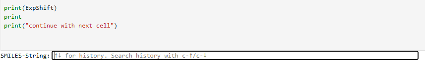
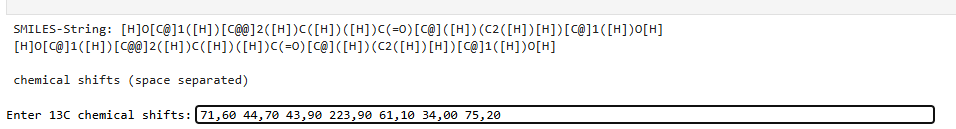
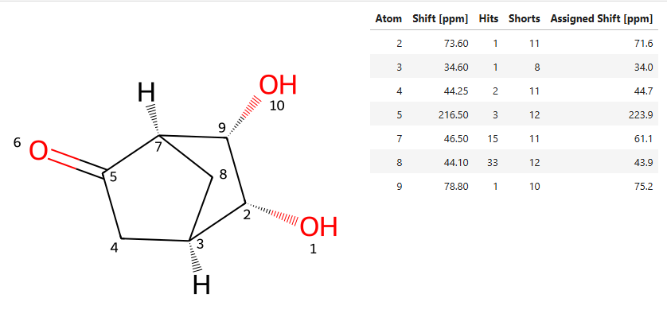

# Distance code for chemical shift calculation


## Binder (working example)
Link to Binder: [](https://mybinder.org/v2/gh/steto123/dcode/8d6b7615fea0cd2a4771eff32cec94889cb1704e?urlpath=lab%2Ftree%2Fcalc-shift-v.04.ipynb)

------

## Introduction

DCode stands for Distance Code, a distance based linear code for describing the atom environment

### Steps and Rules

#### Generating the 3D coordinates with MMFF (maximum of 20 runs with 200 iterations each).

#### Generating the DCode atom name

1. Hydrogens remain simply H

2. The first element is the atomic symbol (C, S, Br, etc.)

3. .The second element is the number of neighbors (atom.GetNeighbors())

4. Ring: "r" for an atom in a ring and "n" for an atom not in a ring.

5. Chirality: Default is No
   - ​			CHI_ALLENE = Al

   - ​			CHI_OCTAHEDRAL = Ot

   - ​			CHI_OTHER = Oh

   - ​			CHI_SQUAREPLANAR = Sp

   - ​			CHI_TETRAHEDRAL = Tt

   - ​			CHI_TETRAHEDRAL_CCW = CC

   - ​			CHI_TETRAHEDRAL_CW = CW

   - ​			CHI_TRIGONALBIPYRAMIDAL = Bp


#### Build the final DCode


### Building the Code


The code starts with the DCodeName for the atom being considered and is separated from the rest by an @. All other atoms are then separated by a #. They are sorted by increasing distance. At 6 angstroms, the process stops.

<u>Example C-2 L-Alanin</u>
C4nCC@H#N3nNo#C4nNo#C3nNo#H#H#H#H#H#O2nNo#O1nNo#H#


### The finale DCode Collection

Origin: NMRShiftDB (all sdf- entries with only one 13C- assignment)
Number of generated code´s: 343625
Minimum number of neighbours: 2


The image above shows the distribution plot of the number of neighbors recorded in the DCode. The distance is limited to 6 Angstroms. The x-axis shows the number of recorded neighbors, and the y-axis shows the number of corresponding DCodes.


The second distribution plot shows the chemical shifts recorded in the codebase, in steps of 10 ppm.  The chemical shift is plotted on the x-axis, and the number of cases on the y-axis.


<u>The minimum an maximum entry:</u>

With a chemical shift of -45.8 ppm for C-Atom 1


With a chemical shift of 292.5 for C- Atom 5:


# First Checks

## test conditions

- 52 compounds, 48 of which were chosen at random

- 419 chemical shifts

- Minimum number of hits 1 (MinT=0) or 11 (MinT=10)

- Minimum number of neighbours: 5 

- The chemical shift was calculated as:

  - arithmetic mean (Methode 1)

  - geometric mean (Methode 2)

  - Median (Methode 3)

  - for at least 10 hits, the 5% trimmed mean; otherwise, the mean (Methode 4

## Mean absolute errors (MAE)


## Error distribution for MinT=0

This setting delivers better results, especially for Method 3 (Mean).


# Assignment Tool


Using the Assignment Tool, you can assign experimentally measured 13C chemical shifts to the individual carbon atoms of a given compound using the DCode calculation method.

Link to Binder: [](https://mybinder.org/v2/gh/steto123/dcode/cea8b1b232dca9619056f793321a6777e52e5e29?urlpath=lab%2Ftree%2Fassignment-tool-v.03.ipynb)

## Quick Start

For this, you only need to enter the SMILES code of the relevant molecule and the list of chemical shifts separated by spaces. Please note that a value for the chemical shift must be entered for each C atom, even if they are chemically equivalent. A check of the values is not performed in the current development stage to avoid unnecessarily complicating the program code.



This picture show the input Line for the SMILES Code. The next picture shows the second input line for the chemical shift list. The chemical shifts are entered consecutively, separated by spaces. Both the English number format (128.5) and the German number format (128,5) are supported. The entry of the SMILES code and the list of shifts is completed by pressing Enter. Then, proceed with the next cell in the execution.



After running the next two cell the result will be shown as following:



The individual table columns have the following meanings:  

- Atom - Atom number corresponding to the formula shown on the left  
- Shift [ppm] - the chemical shift calculated using DCode  
- Hits - the number of matches in the database that were used for the calculation  
- Shorts - the number of abbreviations from the originally generated DCode that were necessary for at least one match  
- Assigned Shift [ppm] - the assigned, entered chemical shift

## Test results

The assignment tool was tested on a total of 49 compounds. These were the same compounds used for the accuracy assessment. However, three compounds had to be removed because one chemical shift could not be calculated for each (no matches with at least 5 required neighbors). This resulted in 391 experimentally determined shifts, of which 323 were correctly assigned. This means that 82.61% of all automatically made assignments matched those from the NMRShiftDB. Unfortunately, I am not currently familiar with comparison values from other calculation and assignment methods, although the misassignments were already proposed by us in 1992 (http://link.springer.com/10.1007/BF00812326).

An alternative approach that was also tested was the assignment based on the smallest difference between experimental and calculated chemical shifts. The corresponding code fragment looked as follows:  
```python
# Function to find the nearest value
def nearest_value(row, available_values):
    shift_value = float(row["Shift [ppm]"])
    # Calculate the nearest value
    nearest_index = (pd.Series(available_values) - shift_value).abs().idxmin()
    nearest_value = available_values[nearest_index]
    
    # Remove the used value from the list
    available_values.pop(nearest_index)
    
    return nearest_value
```

However, only 297 of the chemical shifts were calculated correctly, which corresponds to 75.96% of all tested data. Therefore, the corresponding Jupyter Notebook has not been published here.


# Usage of AI

**Parts of the Python code published here were created with the help of AI (vibe coding). This significantly accelerated the process of program development and debugging.**
