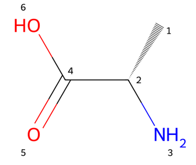
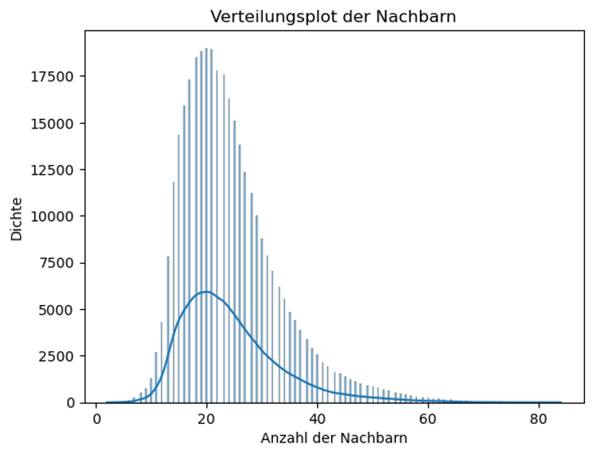
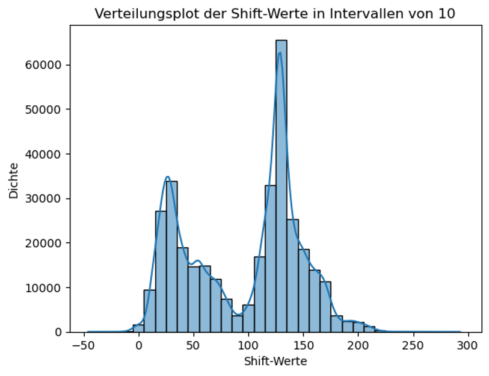
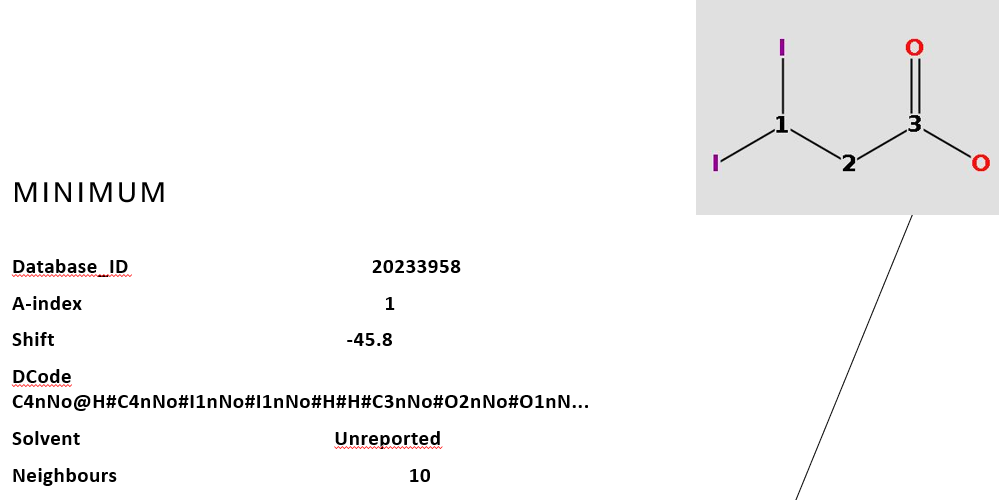
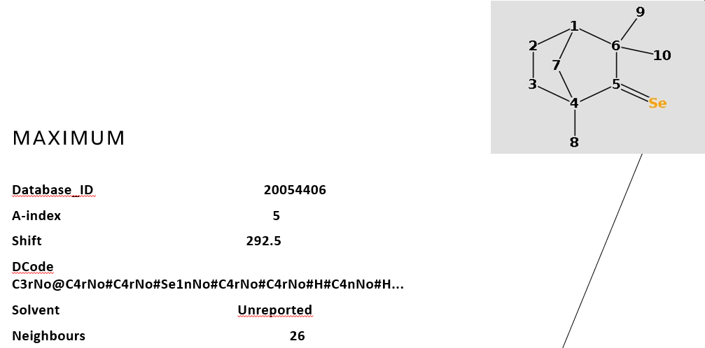
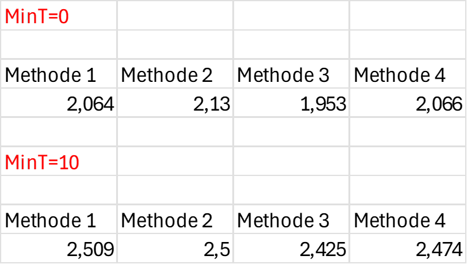
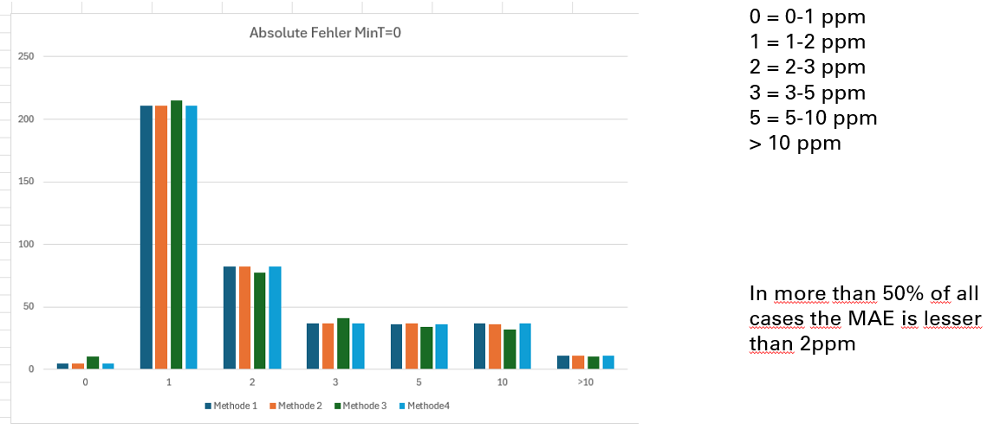

# Distance code for chemical shift calculation

## Binder (working example)
Link to Binder: 
[

## Introduction

DCode stands for Distance Code, a distance based linear code for describing the atom environment

### Steps and Rules

#### Generating the 3D coordinates with MMFF (maximum of 20 runs with 200 iterations each).

#### Generating the DCode atom name

1. Hydrogens remain simply H

2. The first element is the atomic symbol (C, S, Br, etc.)

3. .The second element is the number of neighbors (atom.GetNeighbors())

4. Ring: "r" for an atom in a ring and "n" for an atom not in a ring.

5. Chirality: Default is No
   - ​			CHI_ALLENE = Al

   - ​			CHI_OCTAHEDRAL = Ot

   - ​			CHI_OTHER = Oh

   - ​			CHI_SQUAREPLANAR = Sp

   - ​			CHI_TETRAHEDRAL = Tt

   - ​			CHI_TETRAHEDRAL_CCW = CC

   - ​			CHI_TETRAHEDRAL_CW = CW

   - ​			CHI_TRIGONALBIPYRAMIDAL = Bp

#### Build the final DCode

### Building the Code

The code starts with the DCodeName for the atom being considered and is separated from the rest by an @. All other atoms are then separated by a #. They are sorted by increasing distance. At 6 angstroms, the process stops.

<u>Example C-2 L-Alanin</u>
C4nCC@H#N3nNo#C4nNo#C3nNo#H#H#H#H#H#O2nNo#O1nNo#H#

### The finale DCode Collection

Origin: NMRShiftDB (all sdf- entries with only one 13C- assignment)
Number of generated code´s: 343625
Minimum number of neighbours: 2

The image above shows the distribution plot of the number of neighbors recorded in the DCode. The distance is limited to 6 Angstroms. The x-axis shows the number of recorded neighbors, and the y-axis shows the number of corresponding DCodes.

The second distribution plot shows the chemical shifts recorded in the codebase, in steps of 10 ppm.  The chemical shift is plotted on the x-axis, and the number of cases on the y-axis.

<u>The minimum an maximum entry:</u>

With a chemical shift of -45.8 ppm for C-Atom 1

With a chemical shift of 292.5 for C- Atom 5:

# First Checks

## test conditions

- 52 compounds, 48 of which were chosen at random

- 419 chemical shifts

- Minimum number of hits 1 (MinT=0) or 11 (MinT=10)

- Minimum number of neighbours: 5 

- The chemical shift was calculated as:

  - arithmetic mean (Methode 1)

  - geometric mean (Methode 2)

  - Median (Methode 3)

  - for at least 10 hits, the 5% trimmed mean; otherwise, the mean (Methode 4

## Mean absolute errors (MAE)

## Error distribution for MinT=0

This setting delivers better results, especially for Method 3 (Mean).

